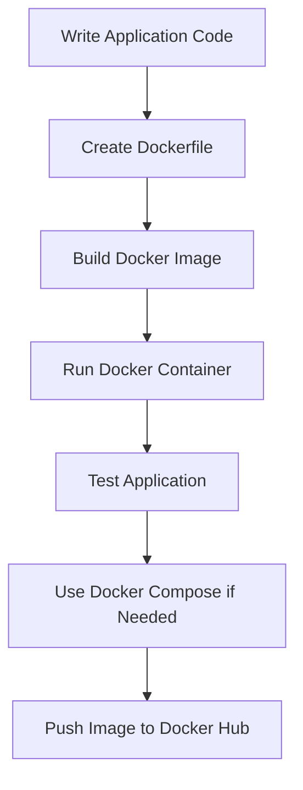

# Docker-Fundamentals
A practical Docker repository with notes, Diagram, and projects from beginner to Intermediate level.

---
📌 About This Repository

This repository is my **practical Docker learning workspace**, where I explored how modern applications are packaged, isolated, and deployed using containers.

 I created this repo to move beyond just writing code and start understanding **real-world development workflows** used in backend, data, and deployment-oriented projects.

Instead of keeping Docker as only a theoretical topic, I used this repository to practice:

- writing Dockerfiles
- building and running images
- managing containers
- using Docker Compose
- understanding  networking, and workflows

---

🎯 Why I Learned Docker

In real development, writing code is not enough.

Applications need to run consistently on different machines, environments, and systems. Docker helps solve that by packaging everything the application needs into containers.

I built this repository to understand:

✅ how developers avoid **“works on my machine”** problems  
✅ how projects are packaged for **deployment**  
✅ how backend / API / ML apps are **containerized**  
✅ how multi-service apps are managed in real workflows  

---

## 🗺️ My Docker Learning Roadmap

flowchart 
    A[Docker Basics] --> B[Images & Containers]
    B --> C[Dockerfile]
    C --> D[Volumes]
    D --> E[Networking]
    E --> F[Docker Compose]
    F --> G[Docker Hub]
    G --> H[Real Projects]
```

---

 📚 Topics Covered

<details>
<summary><b>1️⃣ Docker Fundamentals</b></summary>

- What Docker is
- Why Docker is used
- Containers vs Virtual Machines
- Docker architecture
- Docker Engine basics
- Image → Container workflow


<details>
<summary><b>2️⃣ Core Docker Commands</b></summary>

- `docker pull`
- `docker build`
- `docker run`
- `docker ps`
- `docker stop`
- `docker rm`
- `docker rmi`
- `docker logs`

</details>

<details>
<summary><b>3️⃣ Dockerfile Concepts</b></summary>

- Choosing base images
- `FROM`
- `WORKDIR`
- `COPY`
- `RUN`
- `EXPOSE`
- `CMD`
- Writing custom Dockerfiles

</details>

<details>
<summary><b>4️⃣ Storage & Volumes</b></summary>

- Container storage behavior
- Persistent data
- Named volumes
- Bind mounts

</details>

<details>
<summary><b>5️⃣ Networking</b></summary>

- Port mapping
- Container communication
- Host vs container networking basics

</details>

<details>
<summary><b>6️⃣ Docker Compose</b></summary>

- Multi-container setup
- `docker-compose.yml`
- Running services together


</details>

<details>
<summary><b>7️⃣ Docker Hub</b></summary>

- Tagging images
- Pushing images
- Sharing containerized applications

</details>

---

## 🧠 Docker Workflow I Understood



---

## 🛠️ What I Practiced

This repository includes hands-on work such as:

- building images from scratch
- running containerized applications
- writing Dockerfiles for Python projects
- exposing ports and testing apps locally
- experimenting with container lifecycle commands

---

## 🚀 Sample Commands I Practiced

### Pull an Image
```bash
docker pull python:3.11
```

### Build an Image
```bash
docker build -t my-app .
```

### Run a Container
```bash
docker run -p 8000:8000 my-app
```

### View Running Containers
```bash
docker ps
```

### View All Containers
```bash
docker ps -a
```

### Stop a Container
```bash
docker stop <container_id>
```

### Remove a Container
```bash
docker rm <container_id>
```

### Remove an Image
```bash
docker rmi <image_id>
```

### Start Multi-Container App
```bash
docker compose up --build
```

---

## 🔍 Docker Concepts I Can Explain Now

After working on this repo, I can confidently explain:

| Concept | What I Understand |
|--------|-------------------|
| Docker Image | Blueprint used to create containers |
| Docker Container | Running instance of an image |
| Dockerfile | Instructions to build an image |
| Volume | Persistent storage for containers |
| Port Mapping | Connecting container ports to host machine |
| Compose | Managing multi-container apps |
| Docker Hub | Registry for sharing images |

---

## 💡 Beginner Mistakes I Learned to Avoid

- forgetting to expose ports
- rebuilding unnecessarily without understanding cache
- confusing images with containers
- removing containers but expecting data to persist
- not checking logs when containers fail
- writing inefficient Dockerfiles

---

## 📈 Skills This Repo Reflects

This repository demonstrates my growing understanding of:

- containerization
- backend deployment basics
- developer tooling
- packaging applications
- environment isolation
- practical Docker CLI usage
- real-world development workflow thinking

---

## 🔄 My Learning Progress

```text
[███████████████████░░░] 62%
```

### Current Stage:
**Beginner → Intermediate Docker User**

---

## 🧪 Real-World Use Cases I Want to Apply Docker To

- FastAPI backend projects
- Machine learning inference APIs
- Data science project deployment
- Multi-service applications
- Developer workflow optimization

---

## 🏁 Final Takeaway

This repository represents more than just learning Docker commands.

It reflects my effort to understand how software is **built, packaged, run, and managed** in a way that aligns with real development practices.

Docker has helped me start thinking more like a **developer who ships projects**, not just someone who writes code.

---

## 🤝 Connect / Explore

If you're reviewing this repository, feel free to explore the folders, notes, and mini-projects to see how I approached learning Docker practically.

---

<p align="center">
  ⭐ If you found this repository useful, feel free to star it.
</p>
